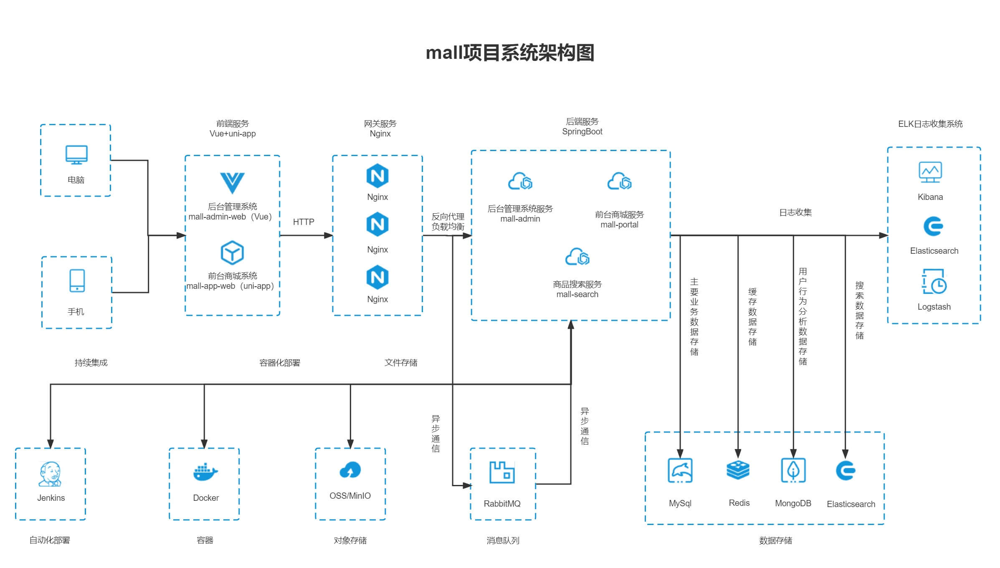

## 关于

`go-mall` 是基于 [gin-boilerplate](https://github.com/ChangSZ/gin-boilerplate) 框架实现的一套电商系统的后台管理系统，包含商品管理、订单管理、会员管理、促销管理、运营管理、内容管理、统计报表、财务管理、权限管理、设置等模块。


> - **快速体验admin** --> [在线访问地址](http://mall.water-melon.top/admin) 
> - **快速体验app**   --> [在线访问地址](http://mall.water-melon.top/app)

</br>
! 本项目暂未未包含任何效果图, 可以去源项目查看, 链接如下:

本项目是对[macrozheng/mall](https://github.com/macrozheng/mall)商城项目后端代码的重构 ==> [进度](./note.md)

mall_admin前端 --> [mall-admin-web](https://github.com/ChangSZ/mall-admin-web) 

mall_portal(app)前端 --> [mall-app-web](https://github.com/ChangSZ/mall-app-web)
<hr/>

## 友情提示
本项目主要是用来学习的～

铁子们, 当前使用中暂未发现问题, 你们可以搭建前后端试着玩着. 有问题麻烦狠狠issue


## 技术选型

### 后端技术

| 技术                 | 说明               | 官网                                       |
| -------------------- | ------------------ | ------------------------------------------ |
| Gin-Boilerplate      | Web应用开发框架    | https://github.com/ChangSZ/gin-boilerplate |
| Gorm                 | ORM框架            | https://github.com/go-gorm/gorm            |
| Golib                | 工具包集合         | https://github.com/ChangSZ/golib           |
| Elasticsearch        | 搜索引擎           | https://github.com/elastic/elasticsearch   |
| RabbitMQ             | 消息队列           | https://www.rabbitmq.com/                  |
| Redis                | 内存数据存储       | https://redis.io/                          |
| MongoDB              | NoSql数据库        | https://www.mongodb.com                    |
| LogStash             | 日志收集工具       | https://github.com/elastic/logstash        |
| Kibana               | 日志可视化查看工具 | https://github.com/elastic/kibana          |
| Nginx                | 静态资源服务器     | https://www.nginx.com/                     |
| Docker               | 应用容器引擎       | https://www.docker.com                     |
| Jenkins              | 自动化部署工具     | https://github.com/jenkinsci/jenkins       |
| MinIO                | 对象存储           | https://github.com/minio/minio             |
| JWT                  | JWT登录支持        | https://github.com/golang-jwt/jwt          |
| Swagger-UI           | API文档生成工具    | https://github.com/swagger-api/swagger-ui  |
| Hibernator-Validator | 验证框架           | https://github.com/go-playground/validator |
| Websocket            | websocket          | https://github.com/gorilla/websocket       |
| Trace                | 链路追踪           | https://go.opentelemetry.io                |

### 前端技术

| 技术       | 说明                  | 官网                                   |
| ---------- | --------------------- | -------------------------------------- |
| Vue        | 前端框架              | https://vuejs.org/                     |
| Vue-router | 路由框架              | https://router.vuejs.org/              |
| Vuex       | 全局状态管理框架      | https://vuex.vuejs.org/                |
| Element    | 前端UI框架            | https://element.eleme.io               |
| Axios      | 前端HTTP框架          | https://github.com/axios/axios         |
| v-charts   | 基于Echarts的图表框架 | https://v-charts.js.org/               |
| Js-cookie  | cookie管理工具        | https://github.com/js-cookie/js-cookie |
| nprogress  | 进度条控件            | https://github.com/rstacruz/nprogress  |

### 移动端技术

| 技术         | 说明             | 官网                                    |
| ------------ | ---------------- | --------------------------------------- |
| Vue          | 核心前端框架     | https://vuejs.org                       |
| Vuex         | 全局状态管理框架 | https://vuex.vuejs.org                  |
| uni-app      | 移动端前端框架   | https://uniapp.dcloud.io                |
| mix-mall     | 电商项目模板     | https://ext.dcloud.net.cn/plugin?id=200 |
| luch-request | HTTP请求框架     | https://github.com/lei-mu/luch-request  |


### 架构图

#### 系统架构图



#### 业务架构图


<hr/>

## 快速开始
### 拉取代码
```bash
$ git clone https://github.com/ChangSZ/mall-go.git
$ cd mall-go
$ go mod tidy
```

### 环境准备
```bash
# 启动mysql、redis等中间件(也可以选择其他方式)
$ docker-compose -f deploy/docker-compose-env.yml up -d
# sql文件拷贝进mysql镜像中
$ docker cp internal/proposal/tablesqls/mall.sql mysql:/
# 进入mysql容器
$ docker exec -it mysql bash
# 登录数据库
$ mysql -u root -proot
# 创建数据库并退出登录
$ CREATE DATABASE api;  # 框架使用
$ CREATE DATABASE mall; 
$ exit;
# 数据导入
$ mysql -u root -p mall < mall.sql
```

### 开始运行
```bash
# 运行GO框架
$ go run main.go -env fat  
# 运行mall_admin
$ go run cmd/mall_admin/main.go -env fat
# 运行mall_portal
$ go run cmd/mall_portal/main.go -env fat
# -env 表示设置哪个环境，主要是区分使用哪个配置文件，默认为 fat
```

### 启动前端
- 注意该项目仅是商城项目的后端API，需要配合前端项目一起使用
  
下载对应前端([mall-admin-web](https://github.com/ChangSZ/mall-admin-web) 或[mall-app-web](https://github.com/ChangSZ/mall-app-web))的代码并启动前端项目。

## Go框架
### 安装界面
首次启动程序之后，会在浏览器中自动打开安装界面，[链接地址](http://127.0.0.1:8080/render/install)

重新启动程序，会在浏览器中自动打开登录界面，[链接地址](http://127.0.0.1:8080)

输入默认账号 admin，密码 admin 即可登录成功

如果想重新安装，删除INSTALL.lock文件即可。该文件存在即认为无需安装。

### 格式化代码
```bash
  go run cmd/mfmt/main.go
```

### 重点使用
- 代码生成器
  - 生成数据表CURD - 选择对应的mysql数据表即可
  - 生成控制器方法 - 输入相对于/internal/api的目录路径即可
- 查询小助手
- 其他的可以用来学习娱乐

### 详细使用介绍
参见[go框架: gin-boilerplate](https://water-melon.top/detail/10)
